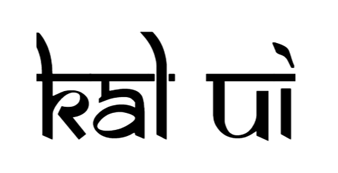

<div align="center">



# Kal UI

Kal UI is free, open sourced library that provides ready-to-use frontend components and it is user-friendly and customizable. Spend less time in designing and concentrate more on logic without hustling on UI.


[](https://app.netlify.com/sites/kal-ui/deploys)

</div>

## Quick Start

You can import the following code snippet in your css or html file to start using the components in your project.

```css
@import url("https://kal-ui.netlify.app/styles/style.css");
```

```html
<link rel="stylesheet" href="https://kal-ui.netlify.app/styles/style.css" />
```

---

## Components

Kal UI allows you to use these components.

-   [Typography](#typography)
-   [Avatar](#avatar)
-   [Alert](#alert)
-   [Badge](#badge)
-   [Button](#button)
-   [Card](#card)
-   [Image](#image)
-   [Input](#input)
-   [List](#list)
-   [Modal](#modal)
-   [Rating](#rating)
-   [Navigation](#navigation)
-   [Toast](#toast)
-   [Grid](#grid)
-   [Slider](#slider)

---

## Overview of components

### Typography

Documentation and examples for Kal-UI typography, including global settings, headings, body text, lists, and more [here](https://kal-ui.netlify.app/pages/typography.html)

-   Headings Available
-   Font Family

---

### Avatar

Avatars are user profile pictures, usually found in circular shapes. Avatars can be used for 'container' objects — projects, spaces, repositories, etcetera — to give them a recognisable visual identity.

You can check out the various types of avatars [here](https://kal-ui.netlify.app/components/avatar/avatar.html)

-   Profile Avatar
-   Sizes Avatar
-   Square Avatar

---

### Alert

An alert displays a short, important message in a way that attracts the user's attention without interrupting the user's task.

You can check out the various types of alerts [here](https://kal-ui.netlify.app/components/alert/alert.html)

-   Basic Alerts
-   Alerts with Actions

---

### Badge

Badges are small circles, positioned either at top-right | top-left | bottom-right | bottom-left of the parent component. Badge can be used to display numbers, online / offline status, depending on where they are used.

You can check out the various types of badges [here](https://kal-ui.netlify.app/components/badge/badge.html)

-   Badge on Avatar
-   Badge on Icons

---

### Button

Buttons allow users to take actions, and make choices, with a single tap.

You can check out the various types of buttons [here](https://kal-ui.netlify.app/components/button/button.html)

-   Primary Buttons
-   Link Buttons
-   Icon Buttons
-   Floating Action Buttons

---

### Card

Cards contain content and actions about a single subject. Cards are surfaces that display content and actions on a single topic. They should be easy to scan for relevant and actionable information. Elements, like text and images, should be placed on them in a way that clearly indicates hierarchy.

You can check out the various types of cards [here](https://kal-ui.netlify.app/components/card/card.html)

-   Text only Card
-   Card with Badge
-   Card with Close Button
-   Card with Text Overlay
-   Horizontal Card
-   Card with shadow

---

### Image

Images can be responsive to fit the parent's width, and also can be customised to be round shaped.

You can check out the various types of images [here](https://kal-ui.netlify.app/components/image/image.html)

-   Responsive Image
-   Round Image

---

### Input

Inputs are necessary for user interaction with the website. Inputs are used to take information from the user, and then send the data to the server.

You can check out the various types of input [here](https://kal-ui.netlify.app/components/input/input.html)

-   Label Input
-   Radio Input
-   Checkbox Input

---

### Text Utilities

Documentation and examples for Kal-UI typography, including global settings, headings, body text, lists, and more.

You can check out the various types of text utilities [here](https://kal-ui.netlify.app/components/text-utilities/text-util.html)

-   Headings
-   Center Text
-   Text Sizes

---

### List

Lists are continuous, vertical indexes of text or images. They are composed of items containing primary and supplemental actions, which are represented by icons and text.

You can check out the various types of list [here](https://kal-ui.netlify.app/components/lists/lists.html)

-   Simple List Groups
-   Nested List Groups
-   Spaced Inline List
-   Notification Stacked List

---

### Navigation

A navigation bar appears at the top of an app screen, below the status bar, and enables navigation through a series of hierarchical screens.

You can check out the simple responsive navigation bar [here](https://kal-ui.netlify.app/components/navigation/navigation.html)

-   Responsive Navigation Bar

---

### Modal Dialog

A dialog is a window overlaid on either the primary window or another dialog window. Content behind a modal dialog is inert, meaning that users cannot interact with it.

You can check out the simple modal [here](https://kal-ui.netlify.app/components/modal/modal.html)

-   Simple modal

---

### Rating

Ratings provide insight regarding others' opinions and experiences, and can allow the user to submit a rating of their own.

You can check out the simple rating [here](https://kal-ui.netlify.app/components/rating/rating.html)

-   Simple rating

---

### Toast

Toasts provide brief notifications. The component is also known as a snackbar.

The toast is used to show alerts on top of an overlay. The toast will close itself when the close button is clicked, or after a timeout — the default is 2 seconds. The toast component is used to give feedback to users after an action has taken place.

You can check out the simple toast [here](https://kal-ui.netlify.app/components/toast/toast.html)

-   Simple Toast

---

### Grid

The grid creates visual consistency between layouts while allowing flexibility across a wide variety of designs.

You can check out the various types of grids [here](https://kal-ui.netlify.app/components/grid/grid.html)

-   Two Column Grid
-   Three Column Grid

---

### Slider

The Slider is used to allow users to make selections from a range of values. Sliders reflect a range of values along a bar, from which users may select a single value. They are ideal for adjusting settings such as volume, brightness, or applying image filters.

You can check out the simple slider [here](https://magnet-ui.netlify.app/docs/docs-components/components/slider.html)

-   Continuous Sliders
-   Discrete Sliders
-   Vertical Sliders

---

## Documentation Website Overview


